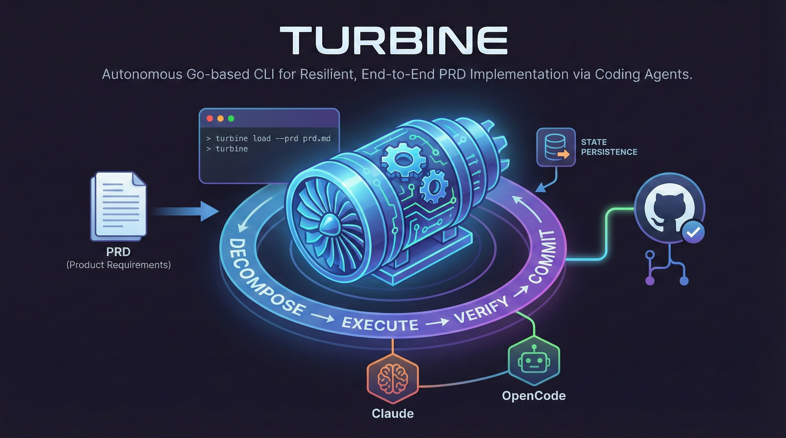

# Turbine

Turbine is a Go-based CLI that autonomously drives coding agents through a resilient "Decompose → Execute → Verify → Commit" loop to implement a PRD end-to-end without human interaction.

<div align="center">
  
</div>

- **PRD decomposition** - Breaks down PRD files into actionable tasks with dependencies
- **AGENTS.md generation** - Creates project guidelines with progressive disclosure and appropriate development methodologies (TDD for backend, UI validation for frontend)
- **Autonomous task execution** - Reads tasks from `.turbine/tasks.yaml` and executes them sequentially
- **Multiple backend support** - Works with Claude and OpenCode agents
- **Resilient execution** - Implements 3x3 rotation/stroke retry policy for reliable task completion
- **State persistence** - Resumes interrupted runs from saved state

## Install

```bash
go install github.com/yarlson/turbine@latest
```

Or build from source:

```bash
go build -o turbine .
```

## Quickstart

1. Create a configuration file at `~/.config/turbine/turbine.yaml` (optional - defaults are provided)
2. Generate project guidelines from your PRD:
   ```bash
   turbine agents --prd path/to/your-prd.md
   ```
3. Load your PRD into the task manifest:
   ```bash
   turbine load --prd path/to/your-prd.md
   ```
4. Spin up the turbine:
   ```bash
   turbine
   ```

## Usage

### Run Tasks Autonomously

```bash
turbine [flags]
```

Reads tasks from `.turbine/tasks.yaml` and executes each one using the configured backend.

### Generate Project Guidelines

```bash
turbine agents --prd <path> [flags]
```

Generates `AGENTS.md` and supporting documentation in `docs/` with progressive disclosure. Automatically selects the appropriate development methodology based on project type:

- **Backend/API/Library** → Test-Driven Development (TDD)
- **Frontend/UI** → Browser/UI validation patterns
- **CLI tools** → Output verification patterns

Also creates a `CLAUDE.md` symlink pointing to `AGENTS.md` for tool compatibility.

### Load PRD into Task Manifest

```bash
turbine load --prd <path> [flags]
```

Takes a PRD file and breaks it down into actionable tasks in `.turbine/tasks.yaml`. The agent will discover and follow any project conventions found in the repository (like TDD from `AGENTS.md`).

### Flags

| Flag        | Description                         |
| ----------- | ----------------------------------- |
| `--backend` | AI backend (`opencode` or `claude`) |
| `--model`   | Model name for the backend          |
| `--variant` | Variant configuration               |
| `--yes`     | Skip confirmation prompts           |
| `--verbose` | Show detailed output                |
| `--debug`   | Show debug logs                     |

## Configuration

See [Configuration Guide](docs/CONFIGURATION.md) for complete configuration options and examples.

### Config File Location

Global configuration is stored at:

- `~/.config/turbine/turbine.yaml`
- or `${XDG_CONFIG_HOME}/turbine/turbine.yaml`

If missing, Turbine uses default configuration with `opencode` backend and 3x3 retry policy.

### Environment Variables

| Variable          | Required | Description                       |
| ----------------- | -------- | --------------------------------- |
| `XDG_CONFIG_HOME` | No       | Override default config directory |
| `NO_COLOR`        | No       | Disable colored terminal output   |

### Model Strategy (Fast vs Slow)

Turbine uses different models for different operations to optimize cost and quality:

**Slow Model** (e.g., Claude Opus 4.5):

- Used for one-time, high-stakes operations
- `turbine agents` - Generates AGENTS.md with methodology selection
- `turbine load` - Decomposes PRD into structured tasks
- Better quality for planning and architecture

**Fast Model** (e.g., Claude Sonnet):

- Used for repetitive implementation work
- Task execution during `turbine run`
- Cost-optimized for iterative development
- Sufficient for most implementation tasks

Configure in `~/.config/turbine/turbine.yaml`:

```yaml
backends:
  claude:
    command: claude
    models:
      fast: claude-3-5-sonnet-latest
      slow: claude-4-5-opus-latest
  opencode:
    command: opencode
    models:
      fast: anthropic/claude-sonnet
      slow: anthropic/claude-opus-4-5
```

Override at runtime:

```bash
# Use fast model explicitly
turbine load --prd PRD.md --variant fast

# Use slow model explicitly
turbine agents --prd PRD.md --variant slow
```

### Tasks File

Task definitions are stored at:

- `./.turbine/tasks.yaml` (tracked in git)

Each task includes:

- `id` - Unique identifier
- `title` - Task title
- `status` - `todo`, `done`, or `failed`
- `deps` - Task dependencies (optional)
- `description` - Detailed description
- `acceptance` - Acceptance criteria
- `verify` - Verification commands
- `commit_message` - Git commit message

### Run Artifacts

Execution logs and state are stored under:

- `./.turbine/runs/` (gitignored)
- `./.turbine/state/` (gitignored)

## Troubleshooting

| Symptom                                        | Solution                                                                                                                                                           |
| ---------------------------------------------- | ------------------------------------------------------------------------------------------------------------------------------------------------------------------ |
| Task execution may fail during agent execution | Turbine implements 3x3 rotation/stroke policy: same-session strokes and new-session rotations. Check `cmd/turbine/run.go` and `internal/run/retry.go` for details. |
| State persistence across restarts              | `.turbine/state/` is used for resume information (gitignored), `.turbine/runs/` for artifacts. Both directories are managed automatically.                         |
| Configuration not found                        | Turbine falls back to default configuration if `~/.config/turbine/turbine.yaml` is missing. Defaults use `opencode` backend with 3x3 retry policy.                 |

## Development

### Prerequisites

- Go 1.25.5 or later

### Build

```bash
go build -o turbine .
```

### Test

```bash
go test ./...
```

## License

MIT License. See [LICENSE](LICENSE) for details.
